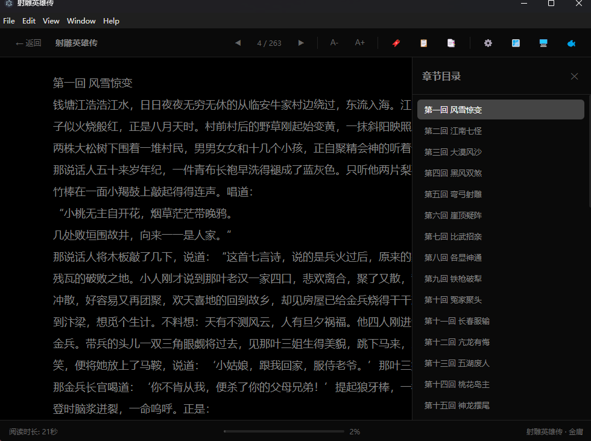
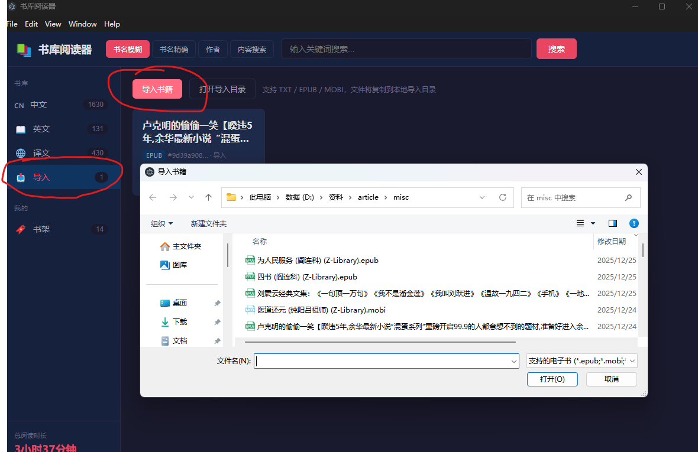
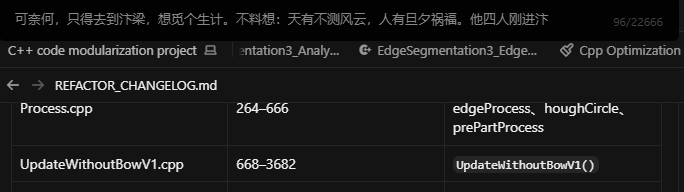
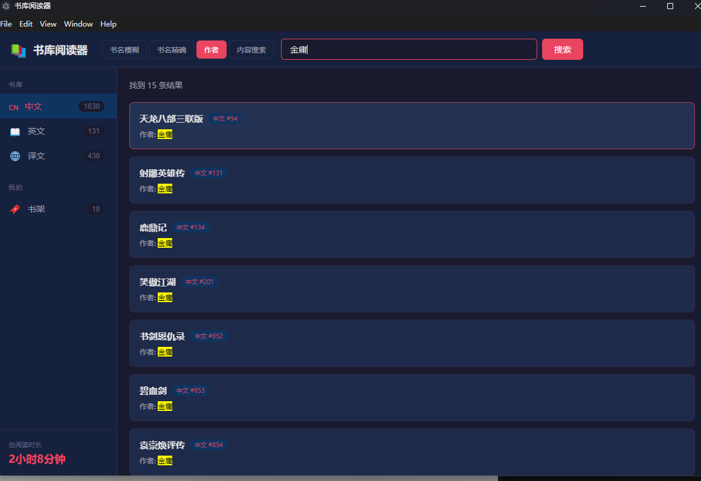
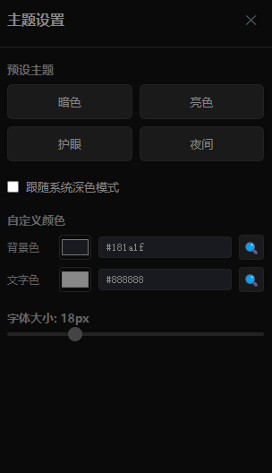

# TXT Book Reader - 书库阅读器

基于 Electron 的电子书阅读器，内置 [doosho/shu](https://github.com/doosho/shu) 书库，支持全屏 / 窗口 / 摸鱼三种阅读模式，以及书签、书架、搜索、主题自定义等功能。

最新安装包见 [Releases](https://github.com/masterball-w/txt_book_reader/releases)。



---

## 更新日志

按日期倒序排列，最新更新在最上方。

### 2026-07-17 · v1.2.0

- **外部导入**：侧栏「导入」支持 TXT / EPUB / MOBI；文件复制到用户目录 `imported-books/`（含 `index.json`、`files/`、`assets/`）
- **格式适配器**：可平行扩展更多格式；PDF / AZW3 / FB2 等暂为 TODO
- **EPUB/MOBI 插图**：窗口与全屏模式显示内嵌图片；摸鱼模式仍为纯文本
- **本地启动器**：根目录 `ShuReader.exe` 替代 `start.bat`（仅用于源码目录双击启动，**不进入**安装包）
- **构建隔离**：`npm start` / `npm run build` / electron-builder / NSIS 流程不变；`npm run build:launcher` 为可选独立脚本


安装包：[`ShuReader-Setup-1.2.0-x64.exe`](https://github.com/masterball-w/txt_book_reader/releases/tag/v1.2.0)

---

### 2026-07-13 · v1.1.0

- **摸鱼模式吞字修复**：改用 DOM 测量替代 canvas；正文中间取样；测量时预留最宽页码宽度
- **章节分页**：窗口 / 全屏按章节边界断页，避免同页混章
- **章节解析增强**：以 `doosho.com` 分隔符定位正文；目录 TOC 精确匹配；支持「卷N」等标题
- **NSIS 安装包**：自定义路径、权限与空间检查、安装日志；使用 electron-builder 宏钩子
- **文档**：README 融入功能截图

安装包：[`ShuReader-Setup-1.1.0-x64.exe`](https://github.com/masterball-w/txt_book_reader/releases/tag/v1.1.0)

---

### 2026-07-10 · v1.0.0

- **初版发布**：三种阅读模式（窗口 / 全屏 / 摸鱼）
- **书库与检索**：内置 cn / en / yi 书库；书名 / 作者 / 全文搜索
- **书签与书架**：进度、书签、阅读时长统计
- **主题系统**：预设主题、自定义颜色、屏幕取色、跟随系统
- **章节跳转**：正则识别章节；窗口 / 全屏面板与摸鱼原生菜单
- **跨模式位置统一**：以行索引作为通用进度参照，切换模式不跳页
- **摸鱼分页**：按可见宽度动态测量，减少页间丢字

安装包：[`ShuReader-Setup-1.0.0-x64.exe`](https://github.com/masterball-w/txt_book_reader/releases)（历史版本）

---

## 功能概览

### 阅读模式


- **窗口模式** — 标准窗口阅读，工具栏可操作
- **全屏模式** — 沉浸式全屏，鼠标悬停显示工具栏
- **摸鱼模式** — 无边框透明长条、始终置顶，`` Ctrl+` `` 一键隐藏/显示



### 搜索 / 书签 / 主题





- 书名模糊 / 精确、作者、全文内容搜索
- 书签、书架、阅读时长
- 暗色 / 亮色 / 护眼 / 夜间主题，屏幕取色，跟随系统

### 快捷键

| 快捷键 | 功能 | 适用模式 |
|--------|------|----------|
| `←` / `PageUp` | 上一页 | 所有模式 |
| `→` / `PageDown` / `空格` | 下一页 | 所有模式 |
| `Ctrl + B` | 保存书签 | 所有模式 |
| `` Ctrl + ` `` | 显示/隐藏摸鱼窗口 | 全局 |
| `Ctrl + Shift + M` | 快速打开摸鱼模式 | 全局 |
| `H` | 隐藏摸鱼窗口 | 摸鱼模式 |
| `Esc` | 退出全屏 | 全屏模式 |

---

## 安装与运行

### 方式一：下载安装包（推荐）

前往 [Releases](https://github.com/masterball-w/txt_book_reader/releases) 下载 `ShuReader-Setup-x.x.x-x64.exe`，双击安装即可。

### 方式二：从源码运行

前置：Node.js 16+、npm

```bash
git clone --recursive https://github.com/masterball-w/txt_book_reader.git
cd txt_book_reader
npm install
```

启动（任选其一）：

- 双击根目录 **`ShuReader.exe`**（Windows 本地开发推荐）
- `npm start`
- 开发模式：`npm run dev` 或 `ShuReader.exe --dev`

重新编译本地启动器（可选，与安装包构建独立）：

```bash
npm run build:launcher
```

### 构建安装包

```bash
npm run build    # → dist/ShuReader-Setup-<version>-x64.exe
```

说明：本地 `ShuReader.exe` / `tools/launcher` 不进入安装包；`npm run build` 不自动执行 `build:launcher`。

---

## 项目结构

```
txt_book_reader/
├── ShuReader.exe     # Windows 本地开发启动器（不进入安装包）
├── main.js           # Electron 主进程
├── preload.js        # IPC 安全桥接
├── launch.js         # npm start 启动脚本
├── package.json
├── tools/launcher/   # 启动器源码与编译脚本
├── lib/              # 格式适配器与导入书库
│   ├── formats/
│   └── importedStore.js
├── src/              # 书库界面与阅读器
├── docs/screenshots/
└── shu/              # 书籍资源（Git 子模块：cn / en / yi）
```

---

## 资源文件说明

书籍资源来自 **[doosho/shu](https://github.com/doosho/shu)**（Git 子模块）：

- `shu/cn/` — 中文（约 1645 本）
- `shu/en/` — 英文（约 135 本）
- `shu/yi/` — 译文（约 424 本）

每类含 `books.json` 与对应 `.txt`。本地导入书保存在用户数据目录，不写入 `shu/`。

---

## 致谢

感谢 **[dooshu](https://github.com/doosho)** 提供开源书库 [doosho/shu](https://github.com/doosho/shu)。书籍版权归原作者所有，本项目仅作阅读工具使用。

## License

MIT License - 详见 [LICENSE](LICENSE) 文件。